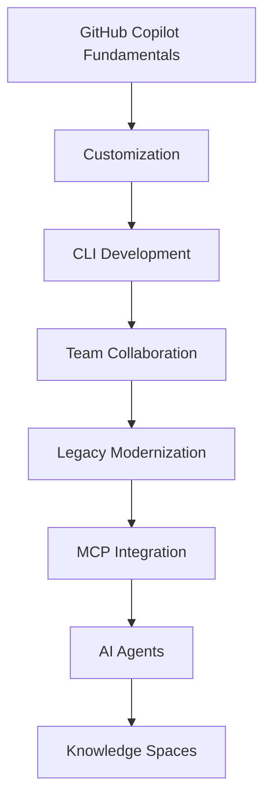

<div align="center">

# 🚀 Take Flight with GitHub Copilot

### AI-Powered Development Learning Portfolio

<p>
  
  
  
  
  
</p>

<p>
  A comprehensive collection of GitHub Skills projects demonstrating practical experience with GitHub Copilot, AI-assisted software development, MCP integration, agent orchestration, and modern engineering workflows.
</p>

</div>

---

## 🎯 Overview

This repository documents my hands-on journey through advanced GitHub Copilot learning paths. Each project focuses on a specific aspect of AI-assisted development, ranging from basic productivity enhancements to sophisticated agent orchestration and enterprise knowledge management.

---

## 🏗 Repository Structure

```text
Take-Flight-With-GitHub-Copilot/
│
├── Getting Started with GitHub Copilot
├── Customize Your GitHub Copilot Experience
├── Expand Your Team with Copilot
├── Create Applications with Copilot CLI
├── Modernize Legacy Code with GitHub Copilot
├── Agent Orchestration Build Your AI Dream Team
├── Integrate MCP with Copilot
└── Scale Institutional Knowledge Using Copilot Spaces
```

---

## 📊 Learning Architecture



---

## 🛠 Technology Stack

<p align="center">


</p>

---

## 📚 Project Showcase

| Project                         | Focus                   |
| ------------------------------- | ----------------------- |
| 🚀 Getting Started with Copilot | Fundamentals            |
| ⚙️ Customize Copilot Experience | Personalization         |
| 👥 Expand Team with Copilot     | Collaboration           |
| 💻 Copilot CLI                  | Application Development |
| 🔄 Legacy Modernization         | Refactoring             |
| 🤖 Agent Orchestration          | AI Teams                |
| 🔗 MCP Integration              | Context Protocol        |
| 🏢 Copilot Spaces               | Knowledge Management    |

---

## 🎓 Skills Acquired

* Prompt Engineering
* AI-Assisted Development
* GitHub Copilot Workflows
* Context Management
* MCP Integration
* Agent Collaboration
* Legacy Code Refactoring
* GitHub Actions
* Developer Productivity Optimization
* Documentation Best Practices

---

## 🏆 Learning Outcomes

✅ Increased coding productivity

✅ Improved documentation generation

✅ Faster debugging workflows

✅ Better code modernization strategies

✅ Understanding of AI agent ecosystems

✅ MCP implementation experience

✅ Knowledge sharing with Copilot Spaces

---

## 📈 GitHub Statistics

```md
Replace with your personal GitHub stats cards.
```

---

## 🛣 Future Roadmap

* [ ] Advanced AI Agent Systems
* [ ] Production MCP Servers
* [ ] Enterprise Copilot Workflows
* [ ] Open Source Contributions
* [ ] AI Engineering Portfolio Expansion

---

<details>
<summary>📖 Repository Goals</summary>

Build practical expertise in AI-assisted software development while mastering GitHub Copilot's modern capabilities.

</details>

---

## 🤝 Contributions

Contributions, suggestions, and improvements are welcome.

If you find this repository useful, consider giving it a ⭐.

---

<div align="center">

### 🚀 Learning • Building • Innovating with GitHub Copilot

Made with ❤️ and AI-powered development practices.

</div>
