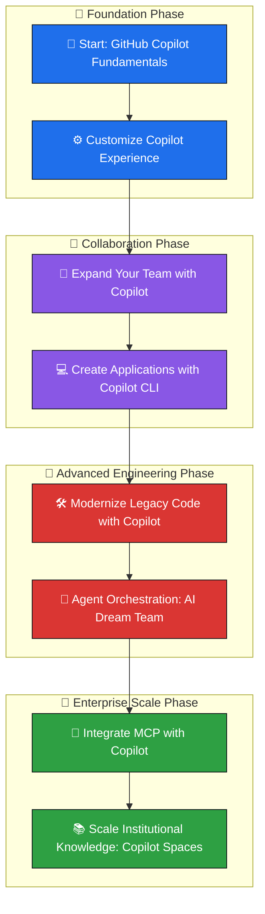

<div align="center">

# 🚀 Take Flight with GitHub Copilot

### *An Enterprise-Grade Hands-On Learning & Certification Portfolio*

<p>
  <em>Mastering AI-assisted software engineering through 8 progressive, real-world GitHub Skills modules — from first prompt to multi-agent orchestration.</em>
</p>

<!-- Animated / Status Badges -->
<p>
  
  
  
</p>

<p>
  
  
  
  
</p>

<!-- Typing animation banner -->
<a href="#">
  
</a>

<br/>

[](#-project-showcase)
[](#-skills-gained)
[](#-future-roadmap)

</div>

<br/>

---

## 📖 Table of Contents

<details>
<summary><strong>Click to expand full navigation</strong> 🧭</summary>

- [📌 Overview](#-overview)
- [🛠️ Technology Stack](#️-technology-stack)
- [🏗️ Repository Architecture](#️-repository-architecture)
- [🎯 Learning Outcomes](#-learning-outcomes)
- [📦 Project Showcase](#-project-showcase)
- [🧠 Skills Gained](#-skills-gained)
- [🏆 Certifications & Achievements](#-certifications--achievements)
- [📊 GitHub Statistics](#-github-statistics)
- [🤝 Contribution Guidelines](#-contribution-guidelines)
- [🗺️ Future Roadmap](#️-future-roadmap)
- [📬 Connect With Me](#-connect-with-me)
- [📄 License](#-license)

</details>

---

## 📌 Overview

> **"Take Flight with GitHub Copilot"** is a structured, hands-on portfolio documenting my journey through GitHub's official **Copilot Skills Track** — a progressive curriculum designed to take a developer from *first AI suggestion* to *orchestrating autonomous AI agent teams* in real engineering workflows.

This repository is **not a tutorial dump** — it's a living **proof-of-competency portfolio** demonstrating:

| 🎯 Focus Area | Description |
|---|---|
| **AI-Pair Programming** | Practical fluency with GitHub Copilot across IDEs, CLI, and chat interfaces |
| **Workflow Automation** | Using Copilot inside GitHub Actions & Dev Containers for CI/CD acceleration |
| **Agentic Engineering** | Designing, orchestrating, and evaluating multi-agent AI systems |
| **Protocol-Level Integration** | Wiring up the **Model Context Protocol (MCP)** for extensible AI tooling |
| **Legacy Modernization** | Using AI to refactor, document, and de-risk legacy codebases |
| **Knowledge Engineering** | Scaling institutional knowledge using **Copilot Spaces** |

Each module in this repo maps to a completed GitHub Skills exercise, complete with code, configuration, and reflective documentation.

---

## 🛠️ Technology Stack

<div align="center">

### Core Platform & AI Tooling


<br>

### Languages


<br>

### DevOps & Infrastructure


</div>

---
## 🏗️ Repository Architecture

> A visual map of how each module builds on the previous one — progressing from **foundational usage** → **customization** → **team-scale collaboration** → **autonomous multi-agent systems**.



<details>
<summary>📂 <strong>Conceptual Folder Structure</strong> (click to expand)</summary>

```bash
take-flight-with-github-copilot/
│
├── 01-getting-started-with-copilot/
│   ├── README.md
│   └── exercises/
│
├── 02-customize-copilot-experience/
│   ├── README.md
│   └── custom-instructions/
│
├── 03-expand-team-with-copilot/
│   ├── README.md
│   └── collaboration-workflows/
│
├── 04-create-apps-with-copilot-cli/
│   ├── README.md
│   └── cli-projects/
│
├── 05-modernize-legacy-code/
│   ├── README.md
│   └── refactoring-samples/
│
├── 06-agent-orchestration/
│   ├── README.md
│   └── multi-agent-pipelines/
│
├── 07-integrate-mcp-with-copilot/
│   ├── README.md
│   └── mcp-servers/
│
├── 08-scale-knowledge-copilot-spaces/
│   ├── README.md
│   └── knowledge-base/
│
└── README.md   👈 you are here
```

</details>

---

## 🎯 Learning Outcomes

By completing this 8-module track, the following competencies were developed and validated:

- ✅ Configure and operate **GitHub Copilot** across multiple environments (IDE, CLI, Chat)
- ✅ Tailor Copilot's behavior using **custom instructions** and **context-aware prompting**
- ✅ Collaborate effectively with Copilot in **team-based, multi-contributor workflows**
- ✅ Build and ship full applications using **Copilot CLI** as a development accelerator
- ✅ Apply AI-assisted strategies to **safely refactor and modernize legacy codebases**
- ✅ Design **multi-agent systems** where specialized AI agents coordinate on complex tasks
- ✅ Integrate the **Model Context Protocol (MCP)** to extend Copilot with custom tools and data sources
- ✅ Architect **Copilot Spaces** to centralize and scale organizational knowledge

---

## 📦 Project Showcase

<table>
<tr>
<td width="50%" valign="top">

### 🟢 1. Getting Started with GitHub Copilot
**Type:** Foundations
Hands-on introduction to AI pair programming — covering suggestion acceptance flows, inline chat, and prompt fundamentals across supported IDEs.

`#copilot-basics` `#ai-pairing` `#fundamentals`

</td>
<td width="50%" valign="top">

### 🟢 2. Customize Your GitHub Copilot Experience
**Type:** Personalization
Configuring custom instructions, repository-level context files, and personal preference tuning to make Copilot suggestions project-aware.

`#custom-instructions` `#context-engineering`

</td>
</tr>

<tr>
<td width="50%" valign="top">

### 🟣 3. Expand Your Team with Copilot
**Type:** Team Collaboration
Exploring how Copilot supports multi-developer workflows, shared context, code review assistance, and team-wide productivity gains.

`#team-collaboration` `#code-review` `#productivity`

</td>
<td width="50%" valign="top">

### 🟣 4. Create Applications with Copilot CLI
**Type:** Applied Development
Building functional applications end-to-end using **Copilot CLI** — from scaffolding to debugging, entirely from the terminal.

`#copilot-cli` `#terminal-driven-dev` `#automation`

</td>
</tr>

<tr>
<td width="50%" valign="top">

### 🔴 5. Modernize Legacy Code with GitHub Copilot
**Type:** Code Transformation
Applying AI-guided refactoring strategies to understand, document, and safely modernize legacy/unfamiliar codebases.

`#legacy-modernization` `#refactoring` `#code-comprehension`

</td>
<td width="50%" valign="top">

### 🔴 6. Agent Orchestration: Build Your AI Dream Team
**Type:** Multi-Agent Systems
Designing coordinated systems of specialized AI agents that divide, execute, and merge complex engineering tasks autonomously.

`#ai-agents` `#orchestration` `#multi-agent-systems`

</td>
</tr>

<tr>
<td width="50%" valign="top">

### 🟡 7. Integrate MCP with Copilot
**Type:** Protocol Engineering
Extending Copilot's capabilities by connecting it to external tools and data sources via the **Model Context Protocol (MCP)**.

`#mcp` `#protocol-integration` `#extensibility`

</td>
<td width="50%" valign="top">

### 🟡 8. Scale Institutional Knowledge Using Copilot Spaces
**Type:** Enterprise Knowledge Systems
Architecting **Copilot Spaces** to centralize documentation, codebases, and institutional knowledge for organization-wide AI assistance.

`#copilot-spaces` `#knowledge-management` `#enterprise-ai`

</td>
</tr>
</table>

---

## 🧠 Skills Gained

<div align="center">

| Category | Skills |
|---|---|
| 🤖 **AI Collaboration** | Prompt engineering, context optimization, inline chat workflows |
| 🧩 **Agentic Systems** | Multi-agent design, task delegation, agent-to-agent coordination |
| 🔌 **Protocol & Tooling** | MCP server integration, custom tool extensions for Copilot |
| 💻 **CLI Engineering** | Terminal-driven app development with Copilot CLI |
| 🛠️ **Code Modernization** | Legacy code analysis, safe refactoring, automated documentation |
| ⚙️ **DevOps Automation** | GitHub Actions pipelines, Dev Container configuration |
| 👥 **Team Workflows** | Collaborative AI-assisted code review and pairing |
| 📚 **Knowledge Engineering** | Organizational knowledge scaling via Copilot Spaces |

</div>

---

## 🏆 Certifications & Achievements

<div align="center">


</div>

<details>
<summary>🎓 <strong>View Completion Checklist</strong></summary>

- [x] Getting Started with GitHub Copilot
- [x] Customize Your GitHub Copilot Experience
- [x] Expand Your Team with Copilot
- [x] Create Applications with Copilot CLI
- [x] Modernize Legacy Code with GitHub Copilot
- [x] Agent Orchestration: Build Your AI Dream Team
- [x] Integrate MCP with Copilot
- [x] Scale Institutional Knowledge Using Copilot Spaces
</details>
---

## 🤝 Contribution Guidelines

This repository is primarily a **personal learning portfolio**, but contributions, suggestions, and discussions are welcome!

<details>
<summary>💡 <strong>How to Contribute</strong></summary>

1. **Fork** the repository
2. **Create** a feature branch
   ```bash
   git checkout -b feature/your-improvement
   ```
3. **Commit** your changes
   ```bash
   git commit -m "Add: meaningful description of change"
   ```
4. **Push** to your branch
   ```bash
   git push origin feature/your-improvement
   ```
5. **Open a Pull Request** with a clear description of the proposed change

### Contribution Ideas
- 📝 Improve module documentation or explanations
- 🐛 Fix code samples or broken links
- ✨ Suggest additional Copilot/MCP use cases
- 🌐 Translate documentation

</details>

---

## 🗺️ Future Roadmap

- [ ] 🧪 Add automated testing pipeline via GitHub Actions for all sample projects
- [ ] 🐳 Containerize each module with dedicated Dev Containers for one-click setup
- [ ] 🔌 Build a custom MCP server demo from scratch (beyond the guided exercise)
- [ ] 🤖 Publish a real-world multi-agent orchestration case study
- [ ] 📊 Add interactive architecture diagrams for each individual module
- [ ] 🌍 Write a companion blog series documenting the learning journey
- [ ] 🏢 Document an enterprise-scale Copilot Spaces deployment pattern
- [ ] 🎥 Record walkthrough videos for each completed module

---

<h3>𝗖𝗼𝗻𝗻𝗲𝗰𝘁 𝘄𝗶𝘁𝗵 𝗺𝗲 🤝</h3>

<p>
  <a href="https://github.com/shriram-02">
    
  </a>

  <a href="https://www.linkedin.com/in/shriram-lahane-12b692385/">
    
  </a>
  <a href="https://leetcode.com/u/shriram_lahane/">
    
  </a>

  <a href="https://auth.geeksforgeeks.org/user/shriram01">
    
  </a>
    <a href="https://www.hackerrank.com/profile/lahaneshriram2">
    
  </a>
  <a href="https://kaggle.com/shriramlahane">
    
  </a>

  <a href="https://instagram.com/pvt.shree_01">
    
  </a>

  <!-- Discord -->
  <a href="https://discord.com/users/shriram_79991" target="_blank">
    
  </a>


---

## 📄 License

This project is licensed under the **MIT License** — feel free to learn from, fork, and build upon this work.

```
MIT License © Shree | Take Flight with GitHub Copilot
```

<div align="center">

<br/>

### ⭐ If this portfolio inspired your own Copilot learning journey, consider giving it a star!


<sub>📍 Crafted as part of a continuous journey toward AI-augmented software engineering excellence.</sub>

</div>
